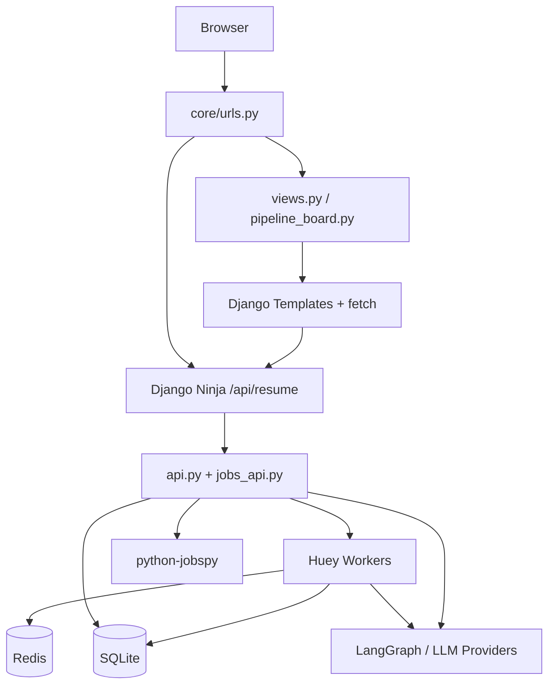
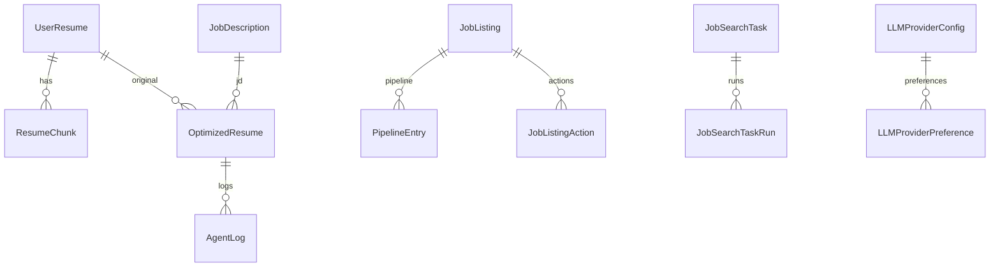

# Codebase Onboarding

**ResumeElite** — AI resume optimizer and job-application pipeline built as a single Django app (`resume_app`) inside `django_project/`.

| | |
|---|---|
| **Git root** | `JobApp-Jules/` |
| **Django cwd** | `JobApp-Jules/django_project/` |
| **Python** | 3.12+ |
| **Framework** | Django 5.2.11 + Django Ninja 1.5.3 |

---

## Quick Start

1. **Clone** the repo.
2. **Install dependencies** (from repo root):
   ```bash
   pip install -r requirements.txt
   ```
3. **Set up environment** — create `JobApp-Jules/.env` (no `.env.example` in repo; see [Environment variables](#environment-variables)).
4. **Run migrations:**
   ```bash
   cd django_project
   python manage.py migrate
   ```
5. **Start dev server** (Terminal 1):
   ```bash
   cd django_project
   python manage.py runserver
   ```
6. **Start Huey worker** (Terminal 2 — required for async optimize, job search automation, periodic tasks):
   ```bash
   cd django_project
   python manage.py run_huey
   ```
   Or set `HUEY_IMMEDIATE=1` in `.env` for single-process dev (no Redis, no periodic scheduler).

Open **http://127.0.0.1:8000/** for the optimizer. API docs (when `DEBUG=True`): **http://127.0.0.1:8000/api/docs**.

---

## Architecture

### Repository layout

```
JobApp-Jules/                    # Git root
├── README.md
├── requirements.txt             # All Python deps
├── .env                         # Gitignored — loaded from parent of django_project
└── django_project/              # Django project root (manage.py lives here)
    ├── manage.py
    ├── db.sqlite3               # Gitignored
    ├── core/                    # settings, urls, WSGI/ASGI
    ├── resume_app/              # Sole custom app (~60+ modules)
    │   ├── models.py, views.py, api.py, jobs_api.py, tasks.py, agents.py, …
    │   ├── templates/resume_app/
    │   ├── migrations/
    │   ├── management/commands/
    │   └── docs/                # ARCHITECTURE_UI, HUEY_TASKS, OPTIMIZER_PAGE, …
    ├── scripts/
    └── media/                   # Uploads + pipeline LLM artifacts (gitignored)
```

**Not a monorepo** — no `pyproject.toml`, `package.json`, Nx, or Turborepo.

### Request flow



| Layer | Technology | Base path |
|-------|------------|-----------|
| **Server UI** | Django templates + Tailwind (CDN) + `fetch()` | `/`, `/jobs/*`, `/settings/`, … |
| **JSON API** | Django Ninja (REST-like) | `/api/resume/`, jobs at `/api/resume/jobs/` |
| **Admin** | Django admin | `/admin/` |
| **Background work** | Huey 2.x + Redis (`huey.contrib.djhuey`) | `python manage.py run_huey` |

**Frontend note:** README mentions Streamlit at `ui/app.py` — **that path does not exist**. The live UI is Django templates under `resume_app/templates/`. No HTMX; interactivity uses vanilla `fetch()` to Ninja endpoints (see `resume_app/docs/ARCHITECTURE_UI.md`).

### `resume_app` module map (start here)

| Area | Key files | Purpose |
|------|-----------|---------|
| HTTP (HTML) | `views.py`, `pipeline_board.py` | Server-rendered pages, POST+redirect |
| HTTP (JSON) | `api.py`, `jobs_api.py` | Django Ninja routers |
| Async | `tasks.py`, `huey_dashboard.py` | `@db_task` / `@db_periodic_task` |
| AI graph | `agents.py`, `prompts.py`, `prompt_store.py` | LangGraph optimizer + prompts |
| Jobs | `job_search_core.py`, `job_sources.py`, `job_ranking.py`, `job_dedupe.py` | JobSpy search, rank, dedupe |
| LLM | `llm_factory.py`, `llm_gateway.py`, `llm_session.py`, `llm_rate_limit.py` | Provider abstraction + rate limits |
| Pipeline LLM | `pipeline_llm_skill_extract.py`, `jd_cleanser.py` | Batch JD skill extraction |
| Data | `models.py`, `schemas.py` | ORM + Ninja schemas |

### Optimizer workflow

Three-agent LangGraph loop: **Writer → ATS Judge → Recruiter Judge**. Iterates up to 3 times or until average score ≥ 85. Full optimize runs in Huey (`optimize_resume_task`).

### Pipeline stages

Kanban boards: **Pipeline → Vetting → Applying → Done** (`pipeline_board.py`). Periodic `pipeline_manager` (every 30 min) refreshes metrics, purges stale rows, auto-promotes to Vetting.

---

## Data Models

**ORM:** Django ORM · **Database:** SQLite (`django_project/db.sqlite3`) · **App:** `resume_app` only · **22 models** in `resume_app/models.py`.

SQLite uses WAL mode + 30s busy timeout (`resume_app/apps.py`) for Huey + runserver concurrency.

### No seed fixtures

| Mechanism | Present? |
|-----------|----------|
| Django fixtures / `loaddata` | No |
| Data migrations | No |

**Runtime bootstrap:** `Track.ensure_baseline()` (IC/mgmt tracks), `AppAutomationSettings.get_solo(pk=1)`, `UserPromptProfile` pk=1, `LLMAppUsageTotals.get_solo(pk=1)`.

### Track pattern

`Track` is a reference table, but most models store **`track` as `CharField` slug** (not FK) for legacy compatibility.

### Entity summary

| Model | Role |
|-------|------|
| `Track` | Preference/search tracks (IC, mgmt, custom) |
| `UserResume` | Uploaded PDFs (`FileField` → `media/resumes/`) |
| `ResumeChunk` | RAG chunks + `embedding` JSONField |
| `JobDescription` | JD text for optimizer runs |
| `OptimizedResume` | Optimizer run/result, scores, snapshots |
| `AgentLog` | Per-step agent trace (`thought` JSONField) |
| `OptimizerWorkflow` | Saved step graphs |
| `UserPromptProfile` | Singleton custom prompts (pk=1) |
| `LLMProviderConfig` | Provider credentials (`encrypted_api_key`) |
| `LLMProviderPreference` | Ordered provider/model rows |
| `LLMAppUsageTotals` / `LLMUsageByModel` / `LLMUsageByQuery` | Usage counters |
| `AppAutomationSettings` | Singleton pipeline automation (pk=1) |
| `JobListing` | Scraped jobs (`raw_json` JSONField) |
| `JobListingAction` | liked / disliked / saved |
| `JobListingEmbedding` | Preference vectors |
| `JobListingTrackMetrics` | Cached per-track scores |
| `UserDisqualifier` | Phrase blocklist |
| `JobMatchResult` | Fit check per job + resume |
| `PipelineEntry` | Job on pipeline board (soft-delete via `removed_at`) |
| `JobSearchTask` / `JobSearchTaskRun` | Scheduled JobSpy searches |

### Relationships (core flow)



### Migrations

| # | File | Change |
|---|------|--------|
| 0001 | `0001_initial.py` | All 22 models |
| 0002 | `0002_userpromptprofile_jd_cleanse.py` | JD cleanse prompt fields |
| 0003 | `0003_llmproviderpreference_is_local.py` | `is_local` on preferences |

### Special fields

- **File upload:** `UserResume.file`
- **JSONField:** embeddings, `raw_json`, workflow `steps`, agent `thought`, optimizer snapshots
- **Encryption:** `LLMProviderConfig.encrypted_api_key` (Fernet via `crypto.py`, key from `SECRET_KEY`)

---

## API Reference

**Style:** Django Ninja REST-like JSON. **OpenAPI:** `/api/docs` when `DEBUG=True`.

### Authentication on APIs

| Mechanism | Scope |
|-----------|-------|
| **None (default)** | Most routes when `API_ACCESS_TOKEN` unset |
| **`X-Api-Token` header** | 5 resume endpoints when `API_ACCESS_TOKEN` set |
| **CSRF** | Same-origin `fetch` from templates |
| **Django staff** | `/admin/` only |

Token-gated endpoints (`api.py`): `POST /optimize`, `GET|POST /status/{id}`, `POST /fit-check`, `POST /llm/complete`. **Jobs API has no token gate.**

### Resume API — `/api/resume/`

| Method | Path | Description |
|--------|------|-------------|
| POST | `/optimize` | Upload PDF + JD; enqueue Huey optimization |
| GET | `/status/{resume_id}` | Poll status, scores, logs |
| POST | `/status/{resume_id}/cancel` | Cancel run |
| POST | `/run-step` | Single agent step (writer, judges) |
| POST | `/fit-check` | Pre-optimize fit score |
| GET | `/export/{id}/pdf`, `/docx` | Download result |
| POST | `/llm/complete` | Generic LLM gateway |
| POST | `/llm/connect` | Validate + encrypt/store API key |
| GET | `/llm/models` | List models for provider |
| GET/POST/PUT/DELETE | `/workflows`, `/workflows/{id}` | Workflow CRUD |
| GET | `/prompts` | Default prompt templates |

### Jobs API — `/api/resume/jobs/`

| Method | Path | Description |
|--------|------|-------------|
| POST | `/search` | JobSpy fetch; upsert + rank |
| GET | `/pipeline`, `/saved`, `/disliked` | Board/saved lists |
| POST | `/{id}/like`, `/dislike`, `/save`, `/unsave` | Actions + embeddings |
| POST | `/{id}/match` | LLM fit check |
| GET | `/matches` | List match results |
| POST | `/ai-match`, `/insights`, `/run-keyword-search` | Batch LLM |
| GET | `/focus-breakdown/{id}` | Score breakdown |
| POST | `/pipeline-resume-summary/start` | Batch skill extraction |
| GET/POST | `/disqualifiers` | Blocklist CRUD |

### Server UI routes (no login)

| Path | Purpose |
|------|---------|
| `/`, `/resume/optimizer/` | Optimizer home |
| `/settings/` | LLM keys, automation, provider prefs |
| `/resume/prompts/` | Prompt library |
| `/jobs/search/` | Job search UI |
| `/jobs/pipeline/`, `/vetting/`, `/applying/`, `/done/` | Kanban boards |
| `/jobs/tracks/`, `/jobs/automation/` | Tracks + cron tasks |
| `/jobs/huey/` | Huey dashboard (queue control) |
| `/workspace/workflows/` | Workflow CRUD (forms) |

Full route list: `django_project/core/urls.py`.

---

## Authentication

**This is a single-tenant tool with no end-user login.**

| Mechanism | Status |
|-----------|--------|
| Django `LoginView` / `@login_required` | Not used |
| Per-user data isolation | None — shared workspace |
| Session cookie | UI state only (track, LLM model, replacements) |
| `API_ACCESS_TOKEN` | Optional gate on 5 resume API routes |
| Django admin | Staff session at `/admin/` |

### LLM key storage

1. **DB (preferred):** `LLMProviderConfig.encrypted_api_key` — Fernet, key derived from `SHA256(SECRET_KEY)` (`resume_app/crypto.py`).
2. **Env fallback:** `OPENAI_API_KEY`, `ANTHROPIC_API_KEY`, `GROQ_API_KEY`, `GOOGLE_API_KEY`.
3. **Connect API:** `POST /api/resume/llm/connect` validates and encrypts (endpoint is **unauthenticated**).

**Production:** Treat as internal-only. Set `API_ACCESS_TOKEN`, `DEBUG=False`, strong `SECRET_KEY`, restrict `/admin/` and `/jobs/huey/`. Rotating `SECRET_KEY` invalidates stored encrypted keys.

---

## Deployment

### What’s in the repo

| Artifact | Status |
|----------|--------|
| Dockerfile / docker-compose | **None** |
| GitHub Actions / CI | **None** |
| `.env.example` | **None** |
| `requirements.txt` | Yes (repo root) |
| WSGI/ASGI | Stock Django (`core/wsgi.py`, `asgi.py`) |

### Environment variables

`.env` lives at **`JobApp-Jules/.env`** (parent of `django_project/`).

**Essential:**

| Variable | Purpose | Default / notes |
|----------|---------|-----------------|
| `SECRET_KEY` | Django + Fernet | Insecure dev default if unset |
| `DEBUG` | Debug mode | `True` if unset |
| `ALLOWED_HOSTS` | Host header allowlist | `[]` |
| `HUEY_REDIS_HOST` | Huey + rate-limit Redis | **`192.168.2.174`** — change for local Redis |
| `HUEY_REDIS_PORT` | Redis port | `6379` |
| `HUEY_IMMEDIATE` | In-process tasks, no Redis | unset = use Redis |

**Security / API:**

| Variable | Purpose |
|----------|---------|
| `API_ACCESS_TOKEN` | Optional `X-Api-Token` for subset of resume APIs |
| `SHOW_DEV_TOOLS` | Dev nav links; defaults to `DEBUG` |

**LLM (optional env fallbacks):**

`OPENAI_API_KEY`, `ANTHROPIC_API_KEY`, `GROQ_API_KEY`, `GOOGLE_API_KEY`

Also used via `getattr(settings, …)` but not in `settings.py`: `OLLAMA_*`, `OPENROUTER_*`.

**Huey / rate limits:** `HUEY_REDIS_DB`, `LLM_RATE_LIMIT_*` (see `core/settings.py`).

### External services

| Service | Role |
|---------|------|
| **Redis** | Huey queue + LLM RPM/TPM limits |
| **SQLite** | Default DB |
| **LLM APIs** | OpenAI, Anthropic, Groq, Google, Ollama, OpenRouter |
| **JobSpy** | Scrapes Indeed and LinkedIn (no API keys) |
| **sentence-transformers** | Local embeddings `all-MiniLM-L6-v2` (first run downloads model) |

### Huey periodic tasks (requires `run_huey` + Redis)

| Task | Schedule |
|------|----------|
| `enqueue_due_job_search_tasks` | Every minute |
| `mark_stale_job_search_runs_failed` | Every 15 min |
| `enqueue_due_vetting_matching_tasks` | Every 20 min |
| `pipeline_manager` | Every 30 min |
| `cleanup_manager` | Daily 01:30 UTC |

### Management commands

```bash
python manage.py huey_queue_status
python manage.py dedupe_pipeline_jobs
python manage.py clear_applying_optimizations
```

### Production (not in repo — bring your own)

- WSGI server (gunicorn/uvicorn) + reverse proxy
- PostgreSQL instead of SQLite
- Dedicated Huey consumer + Redis
- `DEBUG=False`, `ALLOWED_HOSTS`, media/static serving
- Network-level auth (VPN / reverse-proxy) — app has no user login

---

## Gotchas

1. **Default Redis host `192.168.2.174`** — Huey fails on fresh clones until Redis is reachable or you set `127.0.0.1` / `HUEY_IMMEDIATE=1`.
2. **Two processes** for full functionality: `runserver` + `run_huey`.
3. **No `.env.example`** — copy env table above when onboarding teammates.
4. **`SECRET_KEY` rotation** breaks decryption of stored LLM API keys.
5. **SQLite + concurrent Huey threads** — fine for dev; use PostgreSQL in production.
6. **Windows Huey** — `worker_type: "thread"` only (process workers fail on Windows).
7. **Most JSON APIs are open** — `API_ACCESS_TOKEN` only covers 5 resume endpoints; jobs/LLM-connect/workflows stay open.
8. **No media URL wiring in `urls.py`** — may need explicit media serving in dev/production.
9. **README Streamlit stub** — `ui/app.py` does not exist.
10. **JobSpy scraping** — rate limits, blocking, ToS considerations.
11. **First embedding run** — downloads `all-MiniLM-L6-v2` + needs `torch` (large install).

---

## Key Files to Know

| File | Why it matters |
|------|----------------|
| `django_project/core/settings.py` | DB, Huey, LLM keys, job-focus tuning, caches |
| `django_project/core/urls.py` | All HTTP routing |
| `django_project/resume_app/models.py` | Domain schema |
| `django_project/resume_app/views.py` | Server-rendered UI |
| `django_project/resume_app/api.py` | Resume/LLM Ninja API + optional token auth |
| `django_project/resume_app/jobs_api.py` | Jobs/pipeline Ninja API |
| `django_project/resume_app/tasks.py` | Huey background tasks |
| `django_project/resume_app/agents.py` | LangGraph optimizer graph |
| `django_project/resume_app/pipeline_board.py` | Kanban board views |
| `django_project/resume_app/crypto.py` | Fernet encrypt/decrypt for API keys |
| `django_project/resume_app/docs/ARCHITECTURE_UI.md` | UI ↔ API patterns |
| `django_project/resume_app/docs/HUEY_TASKS.md` | Task catalog + ops |
| `django_project/resume_app/docs/OPTIMIZER_PAGE.md` | Optimizer page behavior |
| `requirements.txt` | Pinned dependencies |
| `PIPELINE_DOCUMENTATION.md` | Pipeline domain docs (repo root) |

---

## Further reading

- `README.md` — quick setup (note: Streamlit section is outdated)
- `resume_app/docs/` — in-app architecture and feature docs
- OpenAPI: **http://127.0.0.1:8000/api/docs** (with `runserver` + `DEBUG=True`)
