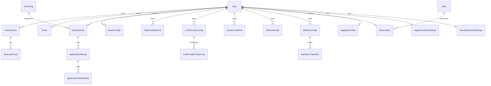

# Codebase Onboarding & Architecture Guide

**HireEdge** — AI-powered resume optimizer, multi-source job aggregation search engine, Kanban application pipeline, and career tools built as a modular Django application (`resume_app`) inside `django_project/`.

| Key Attribute | Specification |
|---|---|
| **Git root** | `JobApp-Main/` |
| **Django root** | `JobApp-Main/django_project/` |
| **Python Version** | 3.12+ |
| **Backend Framework** | Django 5.2.11 + Django Ninja 1.5.3 (OpenAPI) |
| **Primary Database** | SQLite (Dev) / MySQL & MariaDB (Prod with TLS) |
| **Async Task Engine** | Huey 2.6+ (Redis broker) |
| **AI / Orchestration** | LangGraph 1.0+, LangChain, Ollama, OpenAI, Anthropic, Groq, Google GenAI |
| **Browser Automation** | Playwright 1.49+, browser-use 0.11+ |
| **Billing / Monetization** | Stripe (Subscriptions, Customer Portal, Webhooks, Daily Quotas) |

---

## Quick Start

### 1. Install Dependencies
From the repository root (`JobApp-Main/`):
```bash
# 1. Install base dependencies
pip install -r requirements.txt

# 2. Install python-jobspy with --no-deps (avoids upstream markdownify version conflict)
pip install --no-deps -r requirements-jobspy.txt

# 3. Install Playwright browser binaries
playwright install chromium
```

> **Tip:** For local CPU PyTorch installation:
> `pip install torch --index-url https://download.pytorch.org/whl/cpu`

### 2. Environment Configuration
Create `.env` in the repository root (`JobApp-Main/.env`):
```ini
SECRET_KEY=dev-secret-key-change-in-production
DEBUG=True
ALLOWED_HOSTS=localhost,127.0.0.1
HUEY_REDIS_HOST=127.0.0.1
HUEY_REDIS_PORT=6379
HUEY_REDIS_DB=0
```

### 3. Database Setup & Initial Superuser
```bash
cd django_project
python manage.py migrate
python manage.py createsuperuser
```

### 4. Running the Development Stack
Run the following processes concurrently:

- **Terminal 1 (Web Server):**
  ```bash
  cd django_project
  python manage.py runserver 127.0.0.1:8000
  ```

- **Terminal 2 (Huey Worker & Scheduler):**
  ```bash
  cd django_project
  python manage.py run_huey
  ```

> **Note on In-Process Mode:** Set `HUEY_IMMEDIATE=1` in `.env` to run tasks synchronously in-process without Redis. (Periodic cron tasks will not run in immediate mode).

Web interfaces:
- **Application Dashboard:** `http://127.0.0.1:8000/`
- **Interactive OpenAPI Documentation:** `http://127.0.0.1:8000/api/docs`
- **Django Admin:** `http://127.0.0.1:8000/admin/`
- **Huey Operations Dashboard:** `http://127.0.0.1:8000/jobs/huey/` (Staff only)

---

## Repository & App Architecture

### Directory Structure

```
JobApp-Main/                     # Repository Root
├── Dockerfile                   # Production container definition
├── requirements.txt             # Pinned direct Python dependencies
├── requirements-jobspy.txt      # python-jobspy pinned install
├── .env                         # Local environment configuration
├── README.md                    # Project overview & quickstart
├── ONBOARDING.md                # System architectural onboarding (this file)
├── PIPELINE_DOCUMENTATION.md    # Job pipeline & board mechanics
├── MULTI_TENANCY_GAPS.md        # Comprehensive multi-tenancy audit & roadmap
└── django_project/              # Django Project Root (manage.py)
    ├── core/                    # Django project core (settings, urls, wsgi, asgi)
    │   ├── settings.py          # Unified application settings & feature flags
    │   └── urls.py              # Root URL routing & Ninja API registry
    └── resume_app/              # Core Domain App (80+ modules)
        ├── models.py            # 38 ORM models
        ├── views.py             # Server-rendered HTML views
        ├── pipeline_board.py    # Pipeline, Vetting, Applying, Done board controllers
        ├── api.py               # Ninja API: Resume optimizer, LLM, Workflows
        ├── jobs_api.py          # Ninja API: Search, Ranking, Actions, Disqualifiers
        ├── apply_api.py         # Ninja API: Autonomous Apply Agent endpoints
        ├── apply_views.py       # Apply Agent dashboard & review screens
        ├── auth_views.py        # Login, Signup, Logout, Landing, Legal
        ├── account_views.py     # Verification, Password Reset, Data Export/Deletion
        ├── billing_views.py     # Subscription plans, Stripe Checkout & Webhooks
        ├── staff_views.py       # Internal user management & support tooling
        ├── onboarding_views.py  # First-time user onboarding wizard
        ├── tasks.py             # Huey background & periodic tasks
        ├── agents.py            # LangGraph multi-agent resume optimizer graph
        ├── optimizer_budget.py  # Context budgeting & token management
        ├── job_search_core.py   # Multi-board fetch & ranking orchestrator
        ├── job_sources.py       # JobSpy, Dice, Levels, BuiltIn, Adzuna clients
        ├── job_ranking.py       # Vector preference scoring & BM25 keyword matching
        ├── job_dedupe.py        # Pipeline & search deduplication algorithms
        ├── llm_gateway.py       # Centralized LLM gateway (routing, rate limiting)
        ├── llm_policy.py        # Token budgets, timeouts, concurrency limits
        ├── llm_factory.py       # LangChain provider client instantiation
        ├── llm_rate_limit.py    # Redis-backed RPM/TPM token-bucket limiters
        ├── entitlements.py      # SaaS plans, quotas, and feature gates
        ├── billing.py           # Stripe SDK helpers & event dispatching
        ├── api_keys.py          # Customer API key hashing and authentication
        ├── tenancy.py           # Per-user query scoping (`OwnedManager`)
        ├── media_access.py      # Authorized media file streaming & storage backend
        ├── crypto.py            # Fernet credential encryption at rest
        ├── apply_agent/         # Autonomous Apply Agent Subsystem
        │   ├── orchestrator.py  # Apply state machine & step advancement
        │   ├── browser.py       # Playwright browser lifecycle manager
        │   ├── ats_detect.py    # URL & DOM-based ATS detection engine
        │   ├── generic_agent.py # browser-use vision fallback agent
        │   ├── step_capture.py  # Screenshot & action audit capture
        │   └── adapters/        # Custom ATS form-filling adapters
        │       ├── base_form.py # Shared heuristic form-fill engine
        │       ├── greenhouse.py
        │       ├── lever.py
        │       ├── ashby.py
        │       └── icims.py
        ├── docs/                # Feature-specific deep-dive docs
        └── templates/resume_app/# Server-rendered HTML templates
```

---

## Core System Subsystems

### 1. Multi-Agent Resume Optimizer (LangGraph)
- **Workflow:** Single-pass compiled graph: **Writer → ATS Judge → Recruiter Judge → END**.
- **Model Policy:** Optimizer steps require cloud/remote LLMs (`allow_local=False`) to ensure high-quality resume copy.
- **Context Budgets (`optimizer_budget.py`):**
  - Semantic role extraction strips JD fluff before passing to the Writer.
  - Source resume deduplication avoids redundant prompt tokens.
  - Dense vector + BM25 keyword local RAG extracts the most relevant bullet points from `ResumeChunk` embeddings.
- **Interactive Editing:** Live drafting status polled via `/api/resume/status/<id>`, in-browser draft editor, export replacements, and PDF/DOCX generation.

### 2. Multi-Source Job Search & Hybrid Ranking
- **Aggregated Job Sources:**
  - **Indeed & LinkedIn:** Scraped via `python-jobspy`.
  - **Dice.com:** Querying the Dice JSON API with HTML scraping fallback (`dice_client.py`).
  - **Levels.fyi:** Decrypting the Levels.fyi job search API (`levels_client.py`).
  - **BuiltIn.com:** Ingestion client with proxy support (`builtin_client.py`).
  - **Adzuna:** Official REST API integration (`adzuna_client.py`).
- **Hybrid Ranking Pipeline:**
  1. Hard filtering: Whole-word regex disqualifiers (`UserDisqualifier`) and excluded/disliked jobs.
  2. Dense Vector Ranking: Cosine similarity against user's liked and disliked job centroids (`all-MiniLM-L6-v2`).
  3. BM25 Lexical Keyword Boost.
  4. Ollama Seniority Guard: Local Nemotron/Ollama fit check penalizing inappropriate seniority levels.

### 3. Four-Stage Kanban Application Pipeline
- **Stages:**
  1. **Pipeline:** Raw ingested listings with preference margin metrics.
  2. **Vetting:** LLM-based JD cleansing and deep matching prompt yielding an Interview Probability score (0–100).
  3. **Applying:** Shortlisted jobs queued for resume tailoring and autonomous application submission.
  4. **Done:** Completed applications with on-demand AI interview prep generation.
- **Automation:** `pipeline_manager` (every 30 mins) auto-promotes high-scoring jobs and purges stale listings based on user retention settings.

### 4. Autonomous Apply Agent
- **Orchestrator (`apply_agent/orchestrator.py`):** Stateless step-by-step state machine advancing `ApplicationAttempt` rows through:
  `QUEUED` → `OPTIMIZING` → `RESOLVE_AND_DETECT` → `DRY_RUN_FILL` → `AWAITING_APPROVAL` (Semi-Auto) → `SUBMITTING` → `SUCCEEDED` / `FAILED`.
- **ATS Adapters:** High-speed deterministic form fillers for Greenhouse, Lever, Ashby, and iCIMS.
- **Generic Fallback (`generic_agent.py`):** LLM-vision agent powered by `browser-use` for arbitrary corporate job applications.
- **Graduation Engine (`AtsAutoSubmitStats`):** Accounts require N consecutive clean submissions with zero human edits before an ATS graduates to autonomous Full-Auto mode.
- **Audit Logging:** Every browser step logs screenshots, field actions, and network responses (`ApplicationAttemptStep`).

### 5. SaaS Entitlements, Plans & Stripe Billing
- **Plans (`Plan`):** Free, Pro, Unlimited tiers.
- **Quotas (`entitlements.py`, `UsageCounter`):**
  - Daily LLM request limits (`METRIC_LLM_REQUESTS`)
  - Daily LLM token budgets (`METRIC_LLM_TOKENS`)
  - Daily job search run limits (`METRIC_JOB_SEARCHES`)
  - Daily apply agent start limits (`METRIC_APPLY_RUNS`)
  - Storage quota tracking (`storage_quota.py`)
- **Stripe Integration (`billing.py`):** Checkout sessions, billing portal redirect, and webhook processing for `customer.subscription.*`, `invoice.payment_failed`, etc.
- **Customer API Keys (`CustomerApiKey`):** SHA-256 hashed API keys enabling programmatic access via `Authorization: Bearer <key>` or `X-API-Key`.

---

## Data Models & Tenancy Architecture

**Database Engine:** SQLite (Dev) / MySQL or MariaDB (Production).
**Model Count:** 38 ORM models in `resume_app/models.py`.
**Migrations:** 31 database migrations (`0001_initial` through `0031_optimizerworkflow_step_llm_config`).

### Entity Relationship Overview


```mermaid
erDiagram
    User ||--o{ UserResume : owns
    User ||--o{ Track : owns
    User ||--o{ SearchProfile : owns
    User ||--o{ PipelineEntry : owns
    User ||--o{ OptimizedResume : owns
    User ||--o{ LLMProviderConfig : owns
    User ||--o{ CustomerApiKey : owns
    User ||--o{ SiteCredential : owns
    User ||--o{ JobSearchTask : owns
    User ||--|| Subscription : has
    User ||--|| ApplicantProfile : has
    User ||--|| AppAutomationSettings : has
    User ||--|| UserExperienceSettings : has

    UserResume ||--o{ ResumeChunk : has
    JobListing ||--o{ PipelineEntry : references
    PipelineEntry ||--o{ ApplicationAttempt : runs
    ApplicationAttempt ||--o{ ApplicationAttemptStep : logs
    JobSearchTask ||--o{ JobSearchTaskRun : tracks
    LLMProviderConfig ||--o{ LLMProviderPreference : configures
    Plan ||--o{ Subscription : subscribes
```

### Tenancy Model
- **User-Level Scoping:** Data isolation is enforced at the application layer via `OwnedManager` (`.for_user(user)`).
- **Global Shared Tables:** `JobListing` (scraped catalog), `SystemPromptProfile` (global prompt templates), `Plan` (billing tiers), `StripeWebhookEvent` (idempotency logs).
- **Filesystem Isolation:** Resume uploads and apply agent artifacts are partitioned under `media/resumes/<user_id>/` and `media/apply_agent/attempt_<id>/` with access mediated by `media_access.py`.

---

## Authentication & Security

1. **Web Authentication:**
   - `LoginRequiredMiddleware`: Enforces authentication globally across all views (excluding `/accounts/*`, `/admin/*`, `/static/*`, `/billing/stripe/webhook/`).
   - Email verification flow (`REQUIRE_EMAIL_VERIFICATION=True`): Restricts unverified users to verification routes.
   - Session-based CSRF protection on HTML and template `fetch()` calls.
2. **API Authentication:**
   - `NinjaAPI(auth=[django_auth, SessionOrApiKeyAuth()])` supports both active browser sessions and customer API keys (`CustomerApiKey`).
3. **Staff Operations & Impersonation:**
   - Protected staff views under `/staff/users/`.
   - `django-hijack` integration with audit trail logging in `ImpersonationAuditLog`.
4. **Secrets Management:**
   - LLM provider API keys and site credentials are encrypted at rest using symmetric Fernet encryption (`crypto.py`) derived from `SECRET_KEY` or `FERNET_KEYS`.
5. **Abuse Protection:**
   - `AbuseThrottleMiddleware` rate-limits authentication attempts and unauthenticated API spam.

---

## Background Worker & Task Catalog (Huey)

Huey tasks run asynchronously in workers backed by Redis.

### Periodic Scheduled Tasks

| Task Function | Interval | Purpose |
|---|---|---|
| `enqueue_due_job_search_tasks` | Every 1 min | Triggers scheduled `JobSearchTask` runs where `next_run_at <= now`. |
| `apply_agent_heartbeat` | Every 1 min | Drives active `ApplicationAttempt` state machines forward. |
| `mark_stale_job_search_runs_failed` | Every 15 min | Marks hung search runs (>60 mins) as failed. |
| `enqueue_due_vetting_matching_tasks`| Every 20 min | Backfills missing Vetting interview probabilities. |
| `pipeline_manager` | Every 30 min | Re-scores pipeline items, purges low margins, and auto-promotes. |
| `purge_generated_resumes_periodic` | Every 6 hours | Deletes ephemeral generated resume PDFs past retention age. |
| `cleanup_manager` | Daily at 01:30 | Performs deduplication, age retention purges, and dead URL checks. |

### Ad-Hoc / Enqueued Tasks

| Task Function | Trigger |
|---|---|
| `optimize_resume_task(user_id, resume_id, ...)` | Triggered on Resume Optimizer run. |
| `run_job_search_task(user_id, task_id)` | Triggered when a scheduled search fires or user clicks "Run Now". |
| `evaluate_vetting_matching_task(user_id, entry_ids, ...)` | Evaluates JD fit & interview probability in batch. |
| `run_apply_agent_step(user_id, attempt_id)` | Advances a single application attempt browser step. |
| `pipeline_resume_llm_extract_task(run_dir)` | Batch skill extraction for pipeline summary. |
| `dedupe_pipeline_jobs_task(track, stage)` | Administrative pipeline deduplication run. |

---

## Environment Variables Reference

| Variable | Description | Default |
|---|---|---|
| `SECRET_KEY` | Django secret key (used for Fernet derivation) | Insecure dev fallback |
| `DEBUG` | Django debug mode | `True` |
| `ALLOWED_HOSTS` | Comma-separated allowed host header values | `[]` |
| `MYSQL_DATABASE` | MySQL/MariaDB database name (enables MySQL backend) | `""` (uses SQLite) |
| `MYSQL_USER`, `MYSQL_PASSWORD` | MySQL credentials | `""` |
| `MYSQL_HOST`, `MYSQL_PORT` | MySQL connection host and port | `127.0.0.1`, `3306` |
| `MYSQL_SSL_CA` | CA certificate path for verified MySQL TLS | `""` |
| `HUEY_REDIS_HOST`, `HUEY_REDIS_PORT`| Redis broker host and port | `127.0.0.1`, `6379` |
| `HUEY_IMMEDIATE` | Execute tasks in-process without Redis | `False` |
| `STRIPE_SECRET_KEY`, `STRIPE_WEBHOOK_SECRET` | Stripe API credentials | `""` |
| `SAAS_ENFORCE_QUOTAS` | Enforce plan daily request/token quotas | `True` (False in tests) |
| `REQUIRE_EMAIL_VERIFICATION` | Block unverified accounts | `False` |
| `APPLY_BROWSER_HEADLESS` | Run Playwright Chromium in headless mode | `False` (dev default) |
| `OPENAI_API_KEY`, `ANTHROPIC_API_KEY`, `GROQ_API_KEY`, `GOOGLE_API_KEY` | Platform fallback LLM keys | `None` |
| `ADZUNA_APP_ID`, `ADZUNA_APP_KEY` | Adzuna job search API credentials | `""` |
