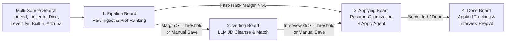

# AI Resume Optimizer: Job Pipeline Documentation

This document describes how job listings are discovered, filtered, vetted, tailored, and applied to across the four lifecycle pipeline stages in ResumeElite.

---

## 1. Pipeline Stage (Discovery & Ingest)

### Discovery & Job Sources
Jobs enter the system via scheduled `JobSearchTask` runs (driven by cron expressions) or manual search triggers:
- **Indeed & LinkedIn:** Scraped via `python-jobspy`.
- **Dice:** Ingested via Dice JSON API / HTML scraper (`dice_client.py`).
- **Levels.fyi:** Ingested via Levels.fyi encrypted API (`levels_client.py`).
- **BuiltIn:** Ingested via BuiltIn API/scraper with proxy support (`builtin_client.py`).
- **Adzuna:** Ingested via official REST API (`adzuna_client.py`).

### Filtering & Scoring Pipeline
1. **Deduplication:** Jobs are deduplicated against existing `JobListing` records by `(source, external_id)` and by content fingerprinting (`job_dedupe.py`).
2. **Disqualifiers (`UserDisqualifier`):** Descriptions are evaluated against user-defined phrase blocklists using a single compiled whole-word regex pattern.
3. **Dense Vector Ranking (`JobListingEmbedding`):**
   - Candidate job titles and descriptions are embedded using `sentence-transformers` (`all-MiniLM-L6-v2`).
   - Embeddings are compared against the user's liked and disliked job centroids.
   - **Preference Margin** (`Like Similarity - Dislike Similarity`) and **Fit %** are computed and cached in `JobListingTrackMetrics`.
4. **Ollama Seniority Guard:**
   - Top-ranked jobs undergo a fast seniority check via Local Ollama (Nemotron 4B). Clear seniority mismatches (e.g., Junior roles for Principal tracks) receive a penalty.

### Stage Ingestion
Listings that pass filters are created as `PipelineEntry` records with `stage="pipeline"` and mapped to the active `SearchProfile` or `Track`.

---

## 2. Vetting Stage (AI Fit Evaluation)

### Promotion Triggers
- **Manual:** User clicks "Save" (favorite) on a listing in the Pipeline board.
- **Automated:** Periodic `pipeline_manager` (every 30 mins) evaluates Pipeline rows and auto-promotes those meeting `pipeline_preference_margin_min`.

### Vetting Evaluation (`evaluate_vetting_matching_task`)
1. **LLM JD Cleansing (`JDCleanserService`):**
   - The job description is processed via Local Ollama to extract core requirements and responsibilities while stripping standard boilerplate (EEO, benefits, company overview), reducing token overhead by 40–60%.
2. **Resume-to-Job Matching:**
   - The cleansed JD is evaluated against the user's latest library resume for that track using the structured Matching prompt.
3. **Scoring:**
   - The LLM assigns an **Interview Probability** (0–100) and rationale (`vetting_interview_reasoning`), stored directly on the `PipelineEntry`.

---

## 3. Applying Stage (Tailoring & Autonomous Submission)

### Promotion Triggers
- **Manual:** User clicks "Save" / "Move to Applying" on a Vetting entry.
- **Automated (Fast-Track):** High-confidence listings with `preference_margin > 50` bypass Vetting and promote directly from Pipeline to Applying.
- **Automated (Normal):** Vetting entries with `vetting_interview_probability >= vetting_interview_probability_min` auto-promote to Applying.

### Resume Optimization
- Users can trigger the multi-agent **Resume Optimizer** (Writer → ATS Judge → Recruiter Judge) to generate tailored resume text and cover letters.
- Context is enriched with token budgets, dense bullet retrieval, and custom user notes.
- Export options generate tailored PDF and DOCX documents with token replacements.

### Autonomous Apply Agent (`apply_agent`)
- Entries in Applying can be processed by the **Autonomous Apply Agent**:
  1. **Resolve & Detect:** Playwright navigates from aggregator URLs to direct job postings and detects the ATS platform (Greenhouse, Lever, Ashby, iCIMS, or custom).
  2. **Dry-Run Fill:** Dedicated ATS adapter or `browser-use` generic agent fills form fields using `ApplicantProfile` and `SiteCredential` data.
  3. **Semi-Auto Mode:** Pauses at `AWAITING_APPROVAL` with screenshots and field summaries for user review and approval.
  4. **Full-Auto Mode:** For graduated ATS adapters (after 10 consecutive clean submissions), the agent autonomously submits applications.

---

## 4. Done Stage (Tracking & Interview Preparation)

### Promotion Triggers
- **Manual:** User clicks "Mark Applied" / "Move to Done" on the Applying board.
- **Automated:** Autonomous Apply Agent transitions the attempt and linked `PipelineEntry` to `DONE` upon confirmed form submission.

### Interview Preparation AI
- For jobs in the Done stage, users can generate on-demand tailored **Interview Prep** packages:
  - Technical deep-dive questions based on the JD requirements and resume claims.
  - Behavioral questions mapped to candidate experience.
  - Company-specific talking points and reverse-interview questions.
