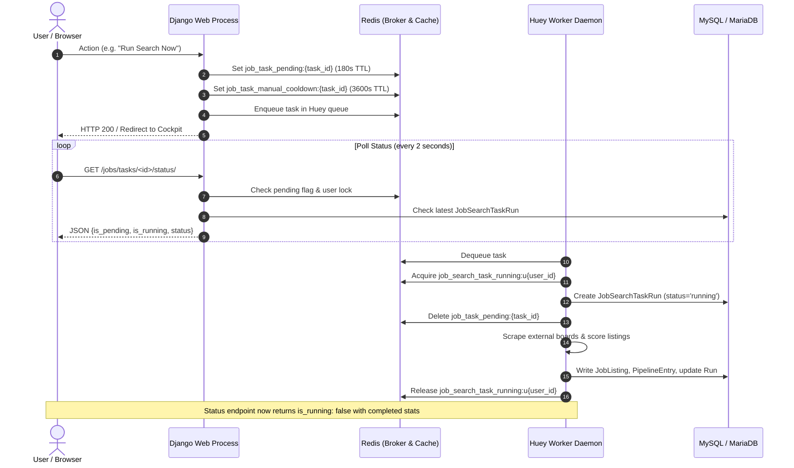
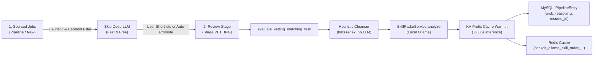

# Architecture

HireEdge is a multi-tenant Django 5.2 application featuring server-rendered HTML views, Django Ninja REST APIs, Huey background workers backed by Redis, and multi-provider LLM integrations.

---

## 1. Runtime Stack

- **Web Framework:** Django 5.2.
- **REST API Framework:** Django Ninja mounted at `/api/` with sub-routers for `/resume/` and `/jobs/`.
- **Authentication & Tenancy:** Session authentication with `LoginRequiredMiddleware` enforcing auth globally. Multi-tenancy uses tenant-scoped models (`owner = ForeignKey(User)`) via `resume_app.tenancy`.
- **Background Worker & Task Queue:** Huey backed by Redis (using `huey.RedisExpireHuey` with automatic result key expiration).
- **Relational Database:** SQLite for local/test defaults; MySQL/MariaDB for production via PyMySQL.
- **AI & Workflow Orchestration:** LangGraph and LangChain for structured resume optimization workflows; OpenAI, Anthropic, Groq, Google Gemini, and local Ollama integrations.
- **Job Sourcing Engine:** Hexagonal architecture supporting JobSpy (Indeed, LinkedIn), Greenhouse direct boards, BuiltIn, Levels.fyi (encrypted API), and Dice (REST API + HTML fallback).
- **UI Architecture:** Server-rendered Django templates styled with Tailwind CSS, Chart.js for data visualization, and vanilla JavaScript `fetch()` for progressive telemetry and status polling. Brand theme tokens live in `resume_app/templates/resume_app/_tailwind_theme.html`.

---

## 2. Project Layout

```text
JobApp-Main/
├── django_project/
│   ├── manage.py                     # Django management entry point
│   ├── core/
│   │   ├── settings.py               # Configuration, apps, middleware, Huey, LLM settings
│   │   └── urls.py                   # Central routing and Ninja API registration
│   └── resume_app/
│       ├── models.py                 # 37 domain models (tenancy, resumes, jobs, pipeline)
│       ├── views.py                  # HTML views (cockpit, optimizer, search, settings, staff)
│       ├── pipeline_board.py         # Kanban pipeline board views and stage transitions
│       ├── api.py                    # Ninja REST API for resume optimizer and LLM endpoints
│       ├── jobs_api.py               # Ninja REST API for jobs, pipeline, and feedback actions
│       ├── tasks.py                  # Huey background workers, cron schedulers, locks
│       ├── sourcing/                 # Hexagonal job scraping architecture (ports, adapters, clients)
│       ├── agents.py                 # LangGraph resume optimizer graph (Writer, ATS, Recruiter)
│       ├── optimizer_budget.py       # Context budget trimming and semantic JD excerpting
│       ├── llm_gateway.py            # Central LLM invocation, routing, quotas, and fallback
│       ├── dashboard_stats.py        # Performance dashboard telemetry aggregation
│       ├── tenancy.py                # Tenant isolation helpers (OwnedManager, get_owned_or_404)
│       └── templates/resume_app/     # Server-rendered HTML templates
├── docs/                             # Developer and agent knowledge base
└── ops/                              # Infrastructure provisioning (MariaDB, Redis)
```

---

## 3. Main Modules & Subsystems

- `models.py` — Domain models partitioned into global shared entities (`JobListing`, `JobDescription`, `AtsJudgeProfile`) and tenant-owned entities (`UserResume`, `OptimizedResume`, `PipelineEntry`, `JobSearchTask`, `SearchProfile`, `EmployerInterviewEvent`).
- `views.py` — Core server-rendered UI: Career Cockpit (`career_cockpit_view`), Resume Optimizer, Find Jobs, Settings, Performance Dashboard, Fit Inspector, and Staff tools.
- `pipeline_board.py` — Multi-stage Kanban pipeline management (Pipeline, Vetting, Applying, Done) with inline feedback actions.
- `api.py` & `jobs_api.py` — Django Ninja REST endpoints for interactive UI actions, background job polling, and data export.
- `tasks.py` — Huey background tasks: scheduled job scraping, vetting matching, metric recalculation, and cleanup.
- `sourcing/` — Hexagonal job ingestion subsystem with dedicated adapters for JobSpy, Greenhouse, BuiltIn, Levels.fyi, and Dice.
- `agents.py` & `optimizer_budget.py` — Multi-agent LangGraph workflow orchestrating resume re-writing, keyword matching, and recruiter readability scoring.
- `llm_gateway.py`, `llm_policy.py`, `llm_factory.py` — Enterprise LLM router managing provider selection, fallback chains, per-user daily token budgets, and concurrency controls.
- `tenancy.py` & `middleware.py` — Multi-tenant query scoping and global authentication enforcement.

---

## 4. Request Flow & Background Processing



---

## 5. Background Task Concurrency & Redis Architecture

To guarantee multi-tenant scalability, prevent duplicate scrapes, and safeguard users against lockouts:

1. **Per-Tenant Concurrency Lock (`job_search_task_running:u{user_id}`):**
   - Implemented via `get_job_search_task_lock_key(user_id)`.
   - Ensures that concurrent searches for different users run in parallel, while multiple searches for the same user are safely queued or skipped.
   - Protected by a Python `try ... finally: cache.delete(lock_key)` block and a 3,600s Redis safety TTL.
2. **Pending Handshake (`job_task_pending:{task_id}`):**
   - Set atomically on task dispatch with a 180s TTL.
   - Prevents the client polling loop from encountering race conditions where a task is enqueued in Redis but not yet written to the database by the worker.
3. **Manual Trigger Cooldown (`job_task_manual_cooldown:{task_id}`):**
   - 60-minute TTL (3,600s) preventing accidental or abusive repeated scraping.
   - **Automatic Failure Recovery:** If a task fails due to a network error, exception, or timeout, the worker and the status views immediately delete this key, allowing the user to retry without waiting an hour.
4. **Vetting Matching Concurrency Lock (`vetting_matching_task_running:u{user_id}`):**
   - 1,800s TTL. Enforces sequential execution of deep analysis per user so local Ollama reuses KV cache prefixes across consecutive jobs.

---

## 6. Review-Stage Deep Analysis & Prefix-Caching Architecture

To eliminate runaway compute costs while providing deep semantic insights, LLM diagnostics are **strictly scoped to the Review (`Vetting`) stage**:



1. **Stage Isolation:** Raw newly sourced listings are evaluated only with fast token embeddings and preference centroids. Deep analysis runs only when a card enters `Stage.VETTING`.
2. **Consolidated Diagnostic Schema:** A single LLM call replaces fragmented matching prompts, returning:
   - `match_score` (0–100 integer)
   - `core_competencies` (substantiated technical & architectural requirements)
   - `stretch_skills` (missing, weak, or unsubstantiated qualifications)
   - `fit_summary` (concise executive fit synthesis)
3. **KV Cache Prefix Alignment:** The prompt orders `Candidate Resume` ahead of `Job Title` and `Job Description`. Because system instructions and candidate resume remain identical across consecutive jobs, local Ollama reuses the precomputed KV cache prefix, achieving ~2.06s inference (a 70% latency reduction).
4. **Heuristic JD Cleansing:** The vetting pipeline uses regex section-stripping (`use_llm=False`) rather than generative rewriting, avoiding cache eviction.
5. **Dual Persistence:**
   - **Redis Cache:** Instant diagnostic modal loading (`cockpit_ollama_skill_radar_{user_id}_{resume_id}_{job_id}`).
   - **Database Fallback:** Persisted to `PipelineEntry` (`vetting_interview_probability`, `vetting_interview_reasoning`). If Redis cache expires, UI cards fall back seamlessly to DB values without showing "unanalyzed".

---

## 7. Resume Optimizer Graph

Default compiled graph: **Writer → ATS Judge → Recruiter Judge** (single pass, `agents.create_workflow`).

- **Context Assembly:** `optimizer_budget.build_optimizer_context_state()` produces a role-focused JD slice (extracting role requirements while omitting generic employer boilerplate), deduplicates prompts, and caps judge context.
- **Hybrid Local Routing:** Writer is cloud-only (`allow_local=False`) for maximum synthesis quality. ATS and Recruiter judges can be routed to local Ollama (`OPTIMIZER_JUDGES_PREFER_LOCAL=True`) to minimize paid API token costs.
- **Reference:** [`django_project/resume_app/docs/OPTIMIZER_PAGE.md`](../django_project/resume_app/docs/OPTIMIZER_PAGE.md).

---

## 8. Authentication, Tenancy & Security

- **Authentication:** Django session authentication. `LoginRequiredMiddleware` blocks unauthenticated access across all app paths (exceptions: `/`, `/accounts/*`, `/admin/`, `/static/`).
- **Owner Scoping:** All user-specific models inherit or use `owner = ForeignKey(User)`. Queries must use `OwnedManager.for_user(user)` or `get_owned_or_404()`.
- **Media Protection:** Media files under `/media/` are served via `serve_media_view`, which checks authentication and ownership authorization.
- **Impersonation:** Staff users with `can_impersonate_users` can impersonate users via `django-hijack`. The session logs audit records in `ImpersonationAuditLog`.
- **Quotas & Throttling:** Governed by `Plan`, `Subscription`, and `UsageCounter`. Rate limiting for APIs and authentication paths is enforced by `AbuseThrottleMiddleware`.

---

## 9. Architectural Rules for Engineers and Agents

1. **Preserve Tenant Scoping:** Never perform un-scoped queries on tenant-owned models. Always use `for_user(user)`.
2. **Global vs Tenant Catalog:** Treat `JobListing` as a shared global catalog; store user reactions, pipeline states, and notes in `PipelineEntry` and `JobListingAction`.
3. **Route LLMs via Gateway:** Never bypass `llm_gateway.py` with direct SDK calls. All calls must respect token budgets, user stop switches, and audit logging.
4. **Reliable Background Execution:** Keep long-running I/O (scraping, AI generation, embedding calculation) in Huey tasks with durable database state.
5. **Lock Lifecycle:** Always wrap Redis lock releases in `try ... finally` blocks and set explicit TTL expiration.
