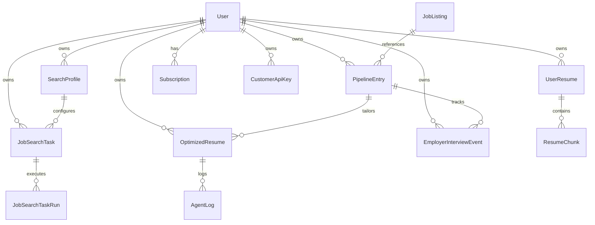

# Data Model

The data layer is defined primarily in `django_project/resume_app/models.py`. It consists of 37 Django models partitioned into a shared global job catalog and tenant-owned entities scoped to individual users.

---

## 1. Multi-Tenant Ownership Model

Tenant isolation is enforced via the `resume_app.tenancy` helpers:
- `OwnedManager.for_user(user)`: Filters rows by `owner = user`.
- `get_owned_or_404(model, user, **lookup)`: Retrieves tenant-scoped rows safely, returning HTTP 404 on cross-tenant access attempts.
- `api_user(request)` & `get_active_user(request)`: Resolves the tenant context (including during staff impersonation).

---

## 2. Model Taxonomy

### 2.1 Shared Global Models (No Tenant Owner)
- **`JobListing`**: Deduplicated catalog of external job postings aggregated across JobSpy (Indeed, LinkedIn), Greenhouse, BuiltIn, Levels.fyi, and Dice.
- **`JobDescription`**: Reusable job description text for optimizer runs.
- **`SystemPromptProfile`**: Singleton admin-managed prompt templates (empty fields fall back to `prompts.py` defaults).
- **`AtsJudgeProfile`**: Reusable ATS scoring prompt templates (`owner = null` for global presets).

---

### 2.2 Resumes & AI Optimization
- **`UserResume`**: User-uploaded source resume PDFs, parsed text, and optional default `SearchProfile` association.
- **`ResumeChunk`**: Chunked text and vector embeddings generated from `UserResume` for dense retrieval (RAG).
- **`OptimizedResume`**: Core output of the resume optimizer. Stores generated markdown/text, ATS fit score, recruiter fit score, token usage, cover letter, and `optimizer_context_snapshot` (char budgets for writer/judge JD and resume inputs).
- **`AgentLog`**: Execution trace logging intermediate outputs from Writer, ATS Judge, and Recruiter Judge nodes.
- **`OptimizerWorkflow`**: Configurable multi-step optimization workflows (system-wide when `owner = null`).

---

### 2.3 Job Discovery, Search Profiles & Automation
- **`SearchProfile`**: Primary user-facing job search context. Combines search query (`search_term`), target location, enabled boards (`site_names`), target resume, and scheduling parameters.
- **`Track`**: Legacy track bucket model (`ic`, `mgmt`, `general`), currently retained and dual-written alongside `SearchProfile` during Phase 1 consolidation.
- **`JobSearchTask`**: Scheduled search automation task. Stores execution schedule (`daily`, `weekdays`, `weekly`, `custom` cron), start time, and active toggle.
- **`JobSearchTaskRun`**: Execution record of a search task. Stores run timestamps, completion status (`running`, `completed`, `failed`), `jobs_fetched`, `jobs_added_to_pipeline`, and `details` JSON (categorized disposition breakdown).
- **`JobListingAction`**: Records per-user actions on job listings: likes, dislikes, saves (favourites), hides, and applied flags.
- **`JobListingEmbedding`**: Dense vector representation of listings for preference calculations.
- **`JobListingTrackMetrics`**: Stores the user's learned preference centroid vector for a specific search profile.
- **`UserDisqualifier`**: User-defined exclusion keywords (titles, companies, or locations) used to screen incoming jobs.

---

### 2.4 Pipeline, Matching & Interview Tracking
- **`PipelineEntry`**: Core Kanban board entry linking a tenant `User` to a global `JobListing`. Stores current stage (`pipeline`, `vetting`, `applying`, `done`), fit score, interview probability, and generated interview prep.
- **`JobMatchResult`**: Semantic and keyword fit score between a specific resume and job description.
- **`EmployerInterviewEvent`**: Tracks real-world interview progression for a pipeline opportunity:
  - `round_type`: Screenings, hiring manager interview, technical assessment, on-site, offer, rejection (`PipelineEntry.PostApplySubstatus`).
  - `status`: Scheduled, completed, cancelled.
  - `scheduled_at` / `completed_at`: Timestamps.
  - `interviewer_info`, `notes`, `feedback`: Post-interview notes.

---

### 2.5 LLM Configuration & Usage Tracking
- **`LLMProviderConfig`**: Stores user-encrypted API keys (Fernet) and default model choices for OpenAI, Anthropic, Groq, Google, and Ollama.
- **`LLMProviderPreference`**: Ordered list of fallback models and optional RPM/TPM limits.
- **`TenantPromptModelPreference`**: Per-tenant model assignments for specific prompts.
- **`LLMAppUsageTotals`**: Lifetime token and request count rollups per user.
- **`LLMUsageByModel`**: Token consumption aggregated by provider and model.
- **`LLMUsageByQuery`**: Token consumption aggregated by functional query type (e.g. `optimizer_writer`, `job_vetting`).
- **`LLMDailyUsageBreakdown`**: Daily token ledger segmented by date and model.

---

### 2.6 SaaS, Billing, Identity & Governance
- **`Plan`**: Commercial subscription tiers (`free`, `pro`, `unlimited`) defining daily quotas (`llm_tokens_per_day`, `llm_requests_per_day`, `job_searches_per_day`, `storage_mb`, `api_access`).
- **`Subscription`**: Tenant plan binding, Stripe customer ID, subscription ID, and billing status (`active`, `past_due`, `canceled`).
- **`UsageCounter`**: Durable per-day metric ledger tracking daily quota consumption.
- **`CustomerApiKey`**: Hashed API keys (HMAC prefix lookup) for authenticating to the Django Ninja REST API.
- **`StripeWebhookEvent`**: Webhook idempotency log preventing duplicate transaction processing.
- **`ImpersonationAuditLog`**: Audit ledger recording staff impersonation sessions via `django-hijack`.
- **`UserExperienceSettings`**: Controls UI mode (`normal` vs `power`), onboarding completion, and email verification status.
- **`AppAutomationSettings`**: Per-user automation toggles and the global `stop_llm_requests` emergency kill-switch.
- **`ApplicantProfile`**: General applicant contact details and demographic information.
- **`UserPromptProfile`**: Legacy model retained for schema compatibility (unused at runtime).

---

## 3. Pipeline Stages & Transitions

`PipelineEntry.stage` values:
1. `pipeline`: Fresh jobs ingested via scheduled or manual search runs.
2. `vetting`: Jobs awaiting deeper review or shortlisted by the user.
3. `applying`: Jobs selected for application tailoring and resume generation.
4. `done`: Applications submitted, interviews in progress, or archived.

---

## 4. Migration & Schema Integrity Rules

1. **Email Uniqueness:** Migration `0025_user_email_unique` enforces a unique index on non-blank `auth_user.email` values.
2. **Multi-Tenant Ownership:** Migration `0014_multi_tenant_owner` established the baseline tenant model across domain entities.
3. **Search Profile Consolidation:** Migration `0020_search_profile_phase1` introduced `SearchProfile` and dual-writing alongside legacy `Track` rows.
4. **Adding New Entities:** When introducing new models, always explicitly declare whether the entity is shared globally, directly owner-scoped (`owner = ForeignKey(User)`), or indirectly owner-scoped through a parent entity.
