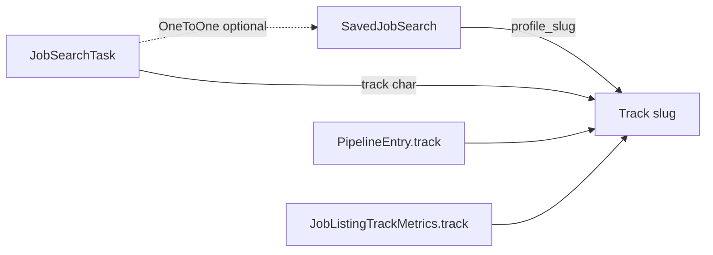
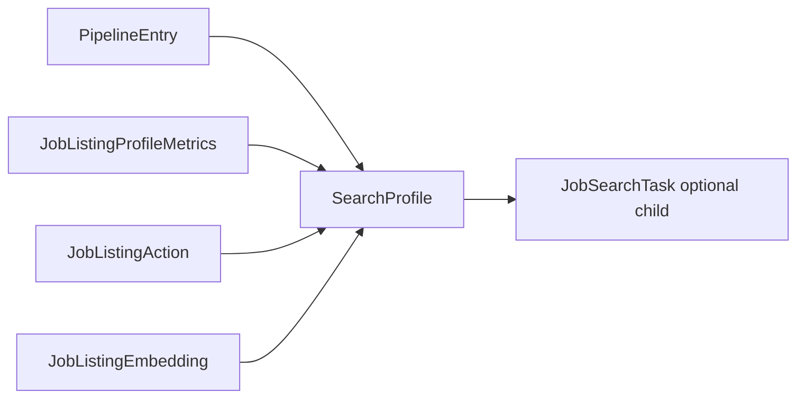

# Search Profile Consolidation Plan

**Status:** Phase 1 implemented (additive model + dual-write)  
**Goal:** Replace the split between `Track`, `SavedJobSearch`, and loosely coupled `JobSearchTask` with a single user-facing primitive — **Search Profile (SP)** — that owns search config, scheduling, pipeline scope, and per-profile scoring.

---

## 1. Executive summary

Today users see **Search profile** / **Saved search** while the database stores:

- `Track` — slug bucket (`ic`, `mgmt`, `fincrimes`, `general`)
- `SavedJobSearch` — named query + `profile_slug` → Track
- `JobSearchTask` — duplicate search fields + `track` (+ optional `saved_search` OneToOne)

This plan **renames and merges** into one model (`SearchProfile`), migrates all `track` char fields to `search_profile_id` FKs, and deprecates `Track`.

**Outcome:** One row per job-search context. Find jobs, My jobs, scheduling, and Huey workers all read/write the same SP.

---

## 2. Current vs target

### Current (simplified)



### Target



---

## 3. `SearchProfile` schema (target model)

Rename `SavedJobSearch` → `SearchProfile` (table rename + model alias during transition).

```python
class SearchProfile(models.Model):
  """Atomic job-search context: query, pipeline bucket, schedule, scoring scope."""

  owner = models.ForeignKey(User, on_delete=models.CASCADE, related_name="search_profiles")

  # Identity
  name = models.CharField(max_length=255)           # UI: "FinCrimes", "PE"
  slug = models.SlugField(max_length=32)            # URL-safe; unique per owner; replaces Track.slug + profile_slug
  description = models.TextField(blank=True)        # optional; from Track.description

  # Search configuration (required search_term on create)
  search_term = models.CharField(max_length=512)  # required; no empty pipeline-only profiles
  location = models.CharField(max_length=512, blank=True, default="")
  resume = models.ForeignKey("UserResume", null=True, blank=True, on_delete=models.SET_NULL)
  min_score = models.PositiveSmallIntegerField(null=True, blank=True)
  results_wanted = models.PositiveSmallIntegerField(default=50)
  site_names = models.JSONField(default=list, blank=True)
  llm_model = models.CharField(max_length=128, blank=True, default="")

  # Scheduling (lift from JobSearchTask / saved_search_schedule)
  schedule_interval = models.CharField(max_length=16, default="off")  # off|daily|weekdays|weekly|custom
  schedule_time = models.TimeField(null=True, blank=True)           # HH:MM for presets
  schedule_cron = models.CharField(max_length=128, blank=True)        # when interval=custom
  schedule_is_active = models.BooleanField(default=False)
  schedule_next_run_at = models.DateTimeField(null=True, blank=True)

  # Flags
  is_default = models.BooleanField(default=False)   # at most one per owner; replaces Track.is_default

  created_at = models.DateTimeField(auto_now_add=True)
  updated_at = models.DateTimeField(auto_now=True)

  class Meta:
    unique_together = [("owner", "name"), ("owner", "slug")]
    ordering = ["-updated_at", "name"]
```

### Child: run history (keep separate)

```python
class SearchProfileRun(models.Model):
  """One execution of a scheduled search (replaces JobSearchTaskRun)."""
  search_profile = models.ForeignKey(SearchProfile, on_delete=models.CASCADE, related_name="runs")
  started_at = models.DateTimeField(auto_now_add=True)
  finished_at = models.DateTimeField(null=True, blank=True)
  status = models.CharField(...)  # running|completed|failed
  jobs_fetched = models.PositiveIntegerField(default=0)
  jobs_added = models.PositiveIntegerField(default=0)
  # ... existing JobSearchTaskRun fields
```

**`JobSearchTask` fate:** Deprecate after migration. Schedule fields live on SP; runs on `SearchProfileRun`. Keep `JobSearchTask` as a DB view/proxy only if needed for one release.

---

## 4. Tables to migrate (`track` → `search_profile_id`)

| Model | Current | Target | Notes |
|-------|---------|--------|-------|
| `PipelineEntry` | `track` CharField | `search_profile` FK | `unique_together`: `(owner, job_listing, search_profile)` |
| `JobListingTrackMetrics` | `track` | `search_profile` FK | Rename → `JobListingProfileMetrics` |
| `JobListingAction` | `track` (blank = legacy global) | `search_profile` FK **required** | No NULL; legacy `track=""` backfilled to default SP only |
| `JobListingEmbedding` | `track` | `search_profile` FK **required** | Centroids per SP; no global embeddings |
| `JobSearchTask` | `track` + duplicate fields | **removed** | Replaced by SP schedule |
| `UserResume` | `track` CharField | `default_search_profile` FK nullable | Optional preferred SP for match |
| `SavedJobSearch` | whole model | **`SearchProfile`** | Rename + absorb slug |
| `Track` | whole model | **deprecated → deleted** | |

**Unchanged:** `JobListing` (global catalog), `PipelineEntry.stage`, optimizer/apply-agent flows (reference job + optional SP for resume default).

---

## 5. URL & API surface

### URLs (user-facing)

| Today | Target |
|-------|--------|
| `/jobs/search/?preset=12` | `/jobs/search/?profile=fincrimes` (accept `preset` + numeric id alias one release) |
| `/jobs/pipeline/?track=fincrimes` | `/jobs/pipeline/?profile=fincrimes` |
| `/jobs/tracks/` | **Remove** (normal) or redirect to profile list (power) |

Prefer **`profile` query param** with **slug** (readable, shareable). Session key: `job_search_profile_slug` replaces `job_search_track`. Resolve slug → row via `(owner, slug)`; reject unknown slugs with 404 or redirect to first SP.

### Ninja API (additive then deprecate)

```
GET    /api/resume/search-profiles/
POST   /api/resume/search-profiles/
GET    /api/resume/search-profiles/{id}/
PATCH  /api/resume/search-profiles/{id}/
DELETE /api/resume/search-profiles/{id}/
POST   /api/resume/search-profiles/{id}/run-now/
PATCH  /api/resume/search-profiles/{id}/schedule/
```

Job search payload: `track` → `search_profile_id` (accept both during deprecation).

---

## 6. Code modules to touch

| Area | Files | Change |
|------|-------|--------|
| Models | `models.py` | SP schema, FKs, rename metrics |
| Migrations | `migrations/0019+` | Data backfill (see §7) |
| Find jobs | `views.py`, `_find_jobs_*`, `saved_searches.py` | Rename helpers → `search_profiles.py` |
| My jobs | `pipeline_board.py` | `profile` param, list SPs only |
| Huey | `tasks.py`, `saved_search_schedule.py` | Run by `search_profile_id` |
| Scoring | `preference.py`, `job_ranking.py`, `job_search_core.py` | FK-based track normalization |
| Pipeline API | `jobs_api.py` | `search_profile` on like/save/search |
| Dedupe/cleanup | `job_dedupe.py`, `job_activity.py` | Scope by SP |
| Onboarding | `onboarding.py`, `experience.py` | Seed no `Track`; gate on SP count |
| Admin | `admin.py` | Register `SearchProfile` |
| Tests | `test_saved_searches.py`, `test_multi_tenant.py`, … | Rename + FK assertions |
| Docs | `data-model.md`, `site-functionality.md`, `api-reference.md` | SP as canonical |

**Delete after cutover:** `track_actions.py` (merge into `search_profile_scope.py`), `tracks.html` views (or repurpose).

---

## 7. Data migration strategy

### Step 7.1 — Add new columns (non-breaking)

1. Create `SearchProfile` table (copy structure from `SavedJobSearch` + schedule columns + `slug`).
2. Add nullable `search_profile_id` FKs to `PipelineEntry`, metrics, actions, embeddings.
3. Add `SearchProfileRun` table.

### Step 7.2 — Backfill `SearchProfile` rows

For each owner:

1. **From `SavedJobSearch`:** insert SP with `name`, search fields, `slug = profile_slug or slugify(name)`.
2. **From orphan `Track`** (no saved search, has pipeline rows): insert SP with `name = track.label`, `slug = track.slug`, empty search fields.
3. **Default:** one `is_default=True` SP per owner (`general` → "General") for legacy rows with `track=""`.

Dedupe slugs per owner (same logic as `_unique_track_slug` today).

### Step 7.3 — Backfill FKs

```text
PipelineEntry.search_profile_id ← match (owner, track slug) → SearchProfile.slug
JobListingTrackMetrics          ← same
JobListingAction/Embedding      ← match (owner, track slug) → SP; track="" → owner default SP (backfill only)
```

### Step 7.4 — Schedule merge

For each `JobSearchTask` with `saved_search_id`:

- Copy `frequency`, `start_time`, `is_active`, `next_run_at` → SP schedule fields.
- Copy `JobSearchTaskRun` → `SearchProfileRun`.

Orphan tasks without `saved_search`: create SP from task name/search_term or attach to matching slug SP.

### Step 7.5 — Enforce & drop legacy

1. `NOT NULL` on `PipelineEntry.search_profile_id` (after orphan cleanup).
2. Drop `PipelineEntry.track`, `SavedJobSearch.profile_slug`, `JobSearchTask.track`, etc.
3. Drop `Track` table.
4. Rename `SavedJobSearch` table to `search_profile` if not already done via model rename.

### Rollback

Keep `track` char columns nullable for one release behind a feature flag `USE_SEARCH_PROFILE_FK=1`.

---

## 8. Phased delivery

### Phase 0 — Freeze semantics (1–2 days) ✅ largely done

- [x] Normal users: My Jobs profiles = saved searches only
- [x] Saving a search creates a dedicated slug/track
- [x] Gate My Jobs until first saved search
- [ ] Document SP as canonical term in UI copy

### Phase 1 — Model additive (3–5 days)

- [x] Add `SearchProfile` model (renamed `SavedJobSearch` + new fields; migration `0020_search_profile_phase1`)
- [x] Add `slug` on SP; stop writing standalone `Track` rows for new saves
- [x] Add nullable FKs on `PipelineEntry`, metrics, actions, embeddings
- [x] Dual-write: new pipeline rows and like/save/dislike set both `track` and `search_profile_id`
- [x] `search_profile_scope.py` helpers; `?profile=` URL + `job_search_profile_slug` session (track= alias kept)

### Phase 2 — Read path switch (3–5 days)

- [x] `resolve_active_profile_slug` / `dual_write_track_fields` (partial; full FK read path pending)
- [ ] `pipeline_board`, `jobs_api`, `preference.py` read FK when set (filter queries still use `track`)
- [x] URLs accept `profile=`; keep `track=` as alias
- [ ] Tests for dual-read

### Phase 3 — Schedule on SP (2–4 days)

- [ ] Move schedule fields to SP (or keep `JobSearchTask` as `scheduled_task` OneToOne but **remove duplicate search fields** — task reads from SP only)
- [ ] Sidebar schedule form writes SP schedule
- [ ] Huey: `run_search_profile(profile_id)` replaces task-centric runner

### Phase 4 — Backfill & cutover (3–5 days)

- [ ] Run data migration §7
- [ ] Drop `track` char columns
- [ ] Remove `Track` model and `/jobs/tracks/` (power: inline advanced edit on SP)
- [ ] Rename module `saved_searches.py` → `search_profiles.py`

### Phase 5 — Cleanup (2–3 days)

- [ ] API rename, remove aliases
- [ ] Update all docs
- [ ] Admin + monitoring for `SearchProfileRun`

**Total estimate:** ~3–4 weeks focused engineering + testing (not including product QA).

---

## 9. UX rules after consolidation

| Action | Behavior |
|--------|----------|
| Save search on Find jobs | Creates or updates SP (name + query + sites) |
| Load profile chip | Sets active SP in session; loads query into form |
| My jobs tabs | Lists user's SPs (same chips as Find jobs) |
| Schedule in sidebar | `schedule_*` on active SP |
| Like / dislike / save job | Scoped to active SP |
| Delete SP | Block if Applying jobs exist; else cascade soft-delete pipeline + remove schedule |
| First-time user | No SP → My jobs setup prompt (current gate) |

**Remove from normal UI:** Track admin, `general` default bucket, hidden `track` form fields.

---

## 10. Product decisions (locked)

1. **Likes / dislikes / saves:** Always scoped to the active **Search Profile**. No global rows after cutover. Legacy `track=""` rows backfill to the owner’s default SP once; all new actions require an SP.
2. **Empty search config:** **Not allowed** — every SP must have a non-empty `search_term` on create/update. No pipeline-only profiles without a query (including power mode).
3. **URLs:** **Slug** in query params and links (`?profile=fincrimes`). Session uses `job_search_profile_slug`. APIs resolve `(owner, slug)`; numeric id only as a temporary alias during migration.
4. **Resume library:** Unchanged — shared `UserResume` library; each SP holds an optional `resume` FK for match/optimize defaults.

---

## 11. Testing checklist

- [ ] Create SP → search → pipeline entries scoped correctly
- [ ] Two SPs: jobs on FinCrimes not visible on PE
- [ ] Schedule run creates pipeline rows on correct SP
- [ ] Like/dislike on SP A does not affect SP B focus scores (no global like rows)
- [ ] Delete SP cleans schedule + empty pipeline
- [ ] Migration: existing `SavedJobSearch` + `Track` + `PipelineEntry` data intact
- [ ] Multi-tenant: owner isolation on all SP FKs
- [ ] Onboarding gate + post-login redirect

---

## 12. Success criteria

- Zero user-facing references to **Track** or **saved search** as separate concepts
- Single source of truth for “what is FinCrimes?” → one `SearchProfile` row
- No `profile_slug` sync or duplicate task search fields
- My jobs and Find jobs profile lists identical by construction

---

## Appendix: interim alias map (one release)

| Legacy | New |
|--------|-----|
| `SavedJobSearch` | `SearchProfile` |
| `profile_slug` / `track` param | `slug` / `profile` param |
| `job_search_track` session | `job_search_profile_slug` |
| `list_saved_searches()` | `list_search_profiles()` |
| `Track.get_default_slug()` | `SearchProfile.get_default_id()` |
| `JobListingTrackMetrics` | `JobListingProfileMetrics` |
