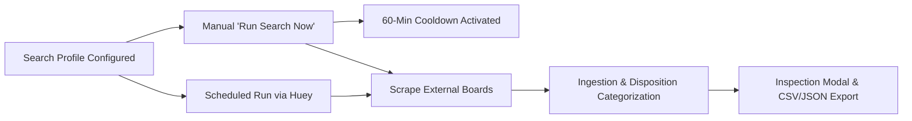

# Site Functionality

HireEdge is a unified, multi-user job search operating system that brings together job discovery, preference-based ranking, automated search tasks, resume optimization, and interview tracking in a single workspace.

---

## 1. Landing Page & Public Access

**Entry point:** `/`

- **Public Marketing Page:** Provides clear calls-to-action for sign-up and sign-in, feature overviews, and product workflow demonstrations using HireEdge's forest green, navy, and mint design theme.
- **Post-Login Routing:** Authenticated users are automatically routed to Getting Started (`/getting-started/`) if their initial setup is incomplete, or directly to their active pipeline board.
- **Legal Compliance:** Public privacy policy (`/legal/privacy/`) and terms of service (`/legal/terms/`).

---

## 2. Onboarding (Getting Started)

**Entry point:** `/getting-started/`

- Displays a step-by-step checklist guiding new users through connecting AI providers, uploading an initial resume, and setting up their first job search.
- **Experience Modes:** Controlled by `UserExperienceSettings`:
  - **Normal Mode:** Streamlined, simple UI focused on primary workflows.
  - **Power Mode:** Exposes advanced developer tools, raw scoring breakdowns, and custom workflow editors.

---

## 3. Career Cockpit & Job Automation

**Entry point:** `/jobs/cockpit/` (Legacy `/jobs/automation/` redirects here)

The Career Cockpit is the primary command center for automated job sourcing.

### Key Capabilities:
1. **Search Task Scheduling:** Define recurring search tasks with frequencies (`daily`, `weekdays`, `weekly`, or custom cron) tied directly to a `SearchProfile`.
2. **On-Demand Manual Trigger:** Click **"Run Search Now"** to execute an immediate search scrape.
3. **60-Minute Cooldown & Auto-Reset:**
   - Enforces a 60-minute interval between manual executions to prevent upstream board blocking.
   - Shows a live countdown timer (`Cooldown: MM:SS`).
   - **Failure Auto-Reset:** If a run fails due to a network glitch, timeout, or worker conflict, the cooldown is automatically cleared immediately so users can retry without waiting.
4. **Interactive Run Inspection Modal:**
   - Clicking on run metrics opens a modal with complete categorization of all fetched postings:
     - *Saved to Pipeline (New)*
     - *Reposted to Pipeline (Cooldown revived)*
     - *Already in Pipeline*
     - *Expired / Not Reposted*
     - *Eliminated (Duplicates or Low Preference)*
     - *Previously Removed / Archived*
   - Includes raw JSON inspection and CSV download.
5. **Skill Radar (`/jobs/cockpit/api/skill-radar/`):** Visualizes verified core competencies, stretch skills, and match percentages across opportunities, powered by local Ollama deep analysis.
 
---

## 4. Find Jobs (Job Search)

**Entry point:** `/jobs/search/`

Users perform targeted live searches across multiple boards simultaneously:
- **Supported Boards:** JobSpy (Indeed, LinkedIn), Greenhouse direct boards, BuiltIn, Levels.fyi, and Dice.
- **De-duplication:** Automatically folds identical postings of the same job across multiple aggregators.
- **Live User Feedback:**
  - **Like (Thumbs Up):** Updates the profile's preference centroid to prioritize similar roles in future searches.
  - **Dislike (Thumbs Down):** Immediately hides the card and deprioritizes similar postings.
  - **Hide:** Excludes the job from view without impacting the preference vector.
  - **Save (Heart):** Saves the job to Favourites and adds an active entry on the pipeline board in `Vetting` (Review) stage.
- **Saved Searches & Search Profiles:** Search configurations (keywords, locations, enabled boards, min score) can be saved as named Search Profiles.

---

## 5. Pipeline Board (Kanban Workflow)

**Entry points:** `/jobs/pipeline/`, `/jobs/vetting/`, `/jobs/applying/`, `/jobs/done/`

A Kanban workflow backed by `PipelineEntry` that organizes opportunities across 4 stages:
1. **Pipeline (New):** Freshly ingested jobs from scheduled or manual search runs. Deep LLM analysis is skipped here to keep compute fast and lean.
2. **Vetting (Review):** Jobs shortlisted or saved for detailed fit evaluation.
   - **Automated Deep Analysis:** Moving a job to Review triggers Huey background task `evaluate_vetting_matching_task`, running `SkillRadarService.analyze` on local Ollama.
   - **Prefix-Cached Latency (~2s):** Orders `Candidate Resume` ahead of `Job Description`, achieving ~70% speedup through Ollama's KV prefix cache.
   - **Diagnostic Extraction:** Produces `match_score` (0–100), `core_competencies`, `stretch_skills`, and a concise `fit_summary`.
   - **Persistence:** Persisted on `PipelineEntry` and cached in Redis (`cockpit_ollama_skill_radar_{u}_{r}_{job_id}`).
   - **Auto-Promotion:** If score meets user-configured threshold, can automatically advance card to `Applying`.
3. **Applying (Tailoring):** Opportunities actively undergoing resume tailoring and cover letter generation.
4. **Done (Applied / Closed):** Submitted applications, active interview loops, or archived roles.

### Card Actions & Features:
- Stage advancement buttons (**Shortlist**, **Ready to Apply**, **Mark Applied**).
- Dynamic **Fit %** (resume semantic match) and **Pref %** (feedback centroid alignment).
- **Skill Radar Modal:** Instant diagnostic popup breaking down substantiated competencies vs missing stretch requirements.
- Bulk actions: move stages, run fit checks, or remove listings.
- Disqualifier rules automatically screen out unwanted companies or titles.

---

## 6. AI Resume Optimizer

**Entry point:** `/resume/optimizer/`

A multi-agent tailoring engine orchestrated with LangGraph (Writer → ATS Judge → Recruiter Judge).

- **Input:** Upload source resume PDF + paste target job description.
- **Token Budget & Slicing:** Extracts role requirements and responsibilities using `optimizer_budget.py`, trimming boilerplate employer descriptions to minimize token consumption.
- **Hybrid LLM Routing:**
  - **Writer:** Cloud-only (OpenAI / Anthropic / Groq) for maximum prose quality.
  - **ATS & Recruiter Judges:** Can run on local Ollama instances (`OPTIMIZER_JUDGES_PREFER_LOCAL=True`) to reduce paid API spend.
- **Interactive Editor:** Users can review agent logs, review ATS/Recruiter scores, edit generated markdown drafts, and export clean PDFs or DOCX files.
- **Cover Letter Generator:** Creates customizable cover letters with length controls (Short, Standard, Detailed) tailored to the target role.

---

## 7. Performance Dashboard & Interview Tracking

**Entry point:** `/performance/`

- **Momentum & Velocity:** Visualizes application volume, stage conversion rates, and weekly submission momentum.
- **Progressive Hydration:** Fast initial render from Redis cache (`perf_stats_{user.id}`) hydrated asynchronously via `/performance/api/metrics/`.
- **Employer Interview Tracking (`EmployerInterviewEvent`):**
  - Records interview rounds for pipeline opportunities (Recruiter Screen, Hiring Manager, Technical Screen, On-Site, Offer).
  - Stores interview dates, interviewer details, candidate feedback, and outcome status.

---

## 8. System Fit Inspector (Staff & Power Tool)

**Entry point:** `/system/fit-inspector/`

A diagnostic tool designed for analyzing scoring dynamics between a resume and a job listing:
- Inspects `sentence-transformers` vector distance.
- Breaks down BM25 keyword overlap and lexical matches.
- Validates prompt performance and scoring thresholds.

---

## 9. Settings, Billing & Account Management

**Entry point:** `/settings/` and `/billing/`

- **Account Tab:** Change email (with verification), change password, export account data, or delete account.
- **AI Providers:** Manage encrypted API keys for OpenAI, Anthropic, Groq, Google Gemini, and Ollama; configure default models and fallback sequences.
- **Usage & Quotas:** Real-time visibility into daily LLM token usage, request counts, and plan quotas (`UsageCounter`).
- **Emergency Killswitch:** Global `stop_llm_requests` toggle in automation settings to halt background AI tasks instantly.
- **Stripe Billing:** Manage subscription tiers (Free, Pro, Unlimited) via Stripe Checkout and the Stripe Customer Portal.
- **Staff Administration (`/staff/users/`):** Allows authorized staff (`can_impersonate_users`) to inspect accounts, audit usage, adjust plans, and safely impersonate users via `django-hijack`.
